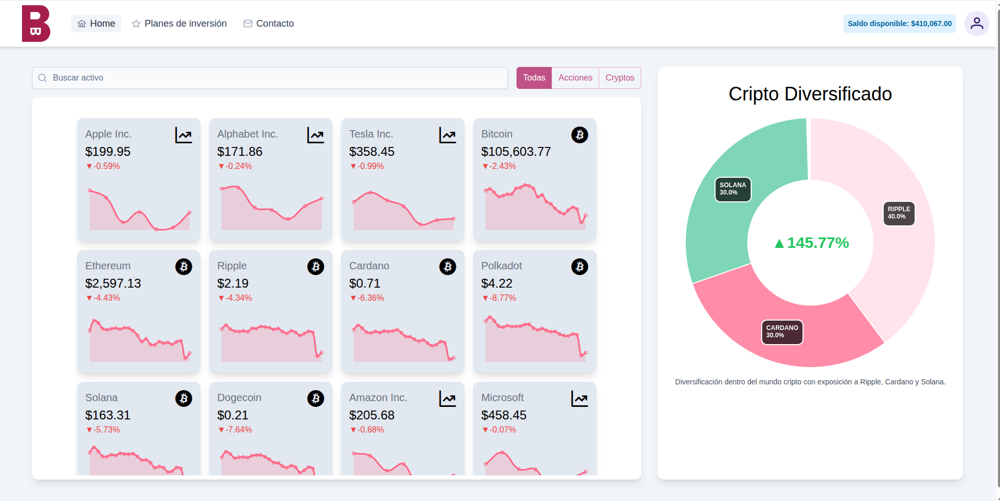
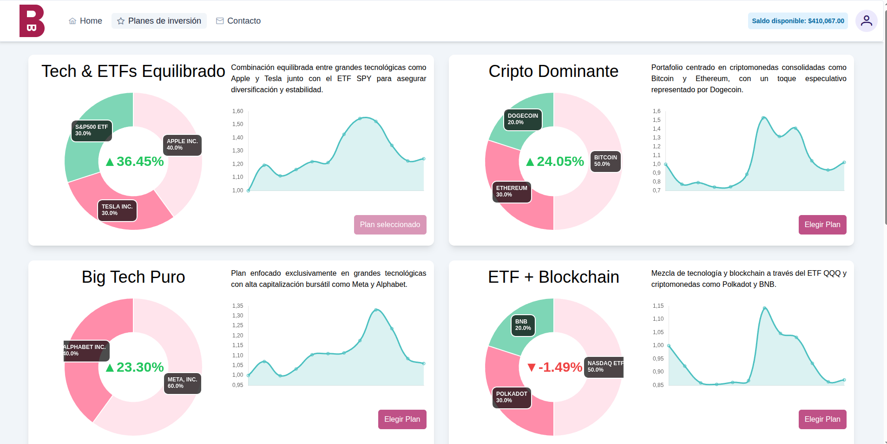
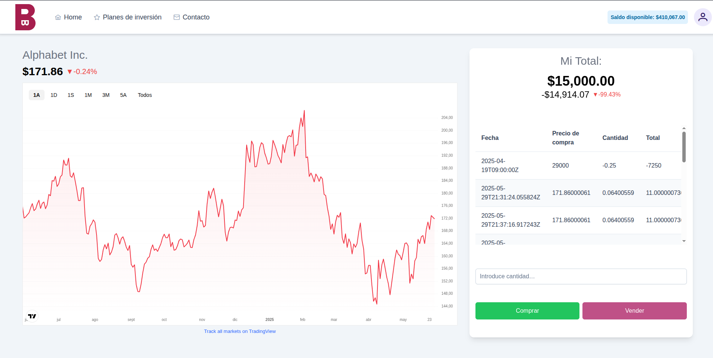
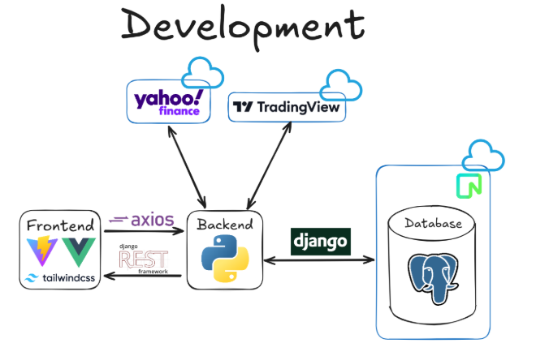
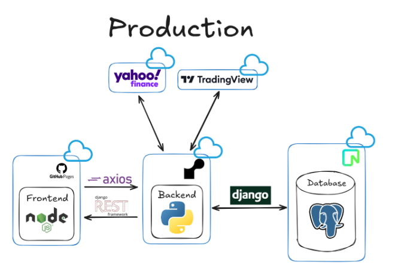

# 💸 Buy and Blood


Buy and Blood es una plataforma de inversión que permite a los usuarios comprar y vender activos financieros, gestionar carteras y acceder a planes de inversión personalizados, todo desde una interfaz clara, moderna y centrada en la experiencia del usuario.

## 📷 Demo

Algunas imágenes de la web en ejecución

<p align="center">
  <strong>Página principal</strong><br>
  
</p>

<p align="center">
  <strong>Planes de inversión</strong><br>
  
</p>

<p align="center">
  <strong>Compra y venta</strong><br>
  
</p>
## 🚀 Funcionalidades principales

- 🔐 **Autenticación con Google**: acceso rápido y seguro.
- 💼 **Gestión de planes de inversión**: crea y modifica tus estrategias.
- 📈 **Compra y seguimiento de activos**: compra directa y visualización en tiempo real.
- 🧾 **Historial de transacciones**: consulta tu actividad completa.
- 🧠 **Recomendaciones personalizadas**: carteras basadas en tu perfil.
- 🌐 **Diseño responsive**: uso fluido desde cualquier dispositivo.

## ⚙️ Tecnologías

- **Frontend**: Vue.js, Vite, TailwindCSS
- **Backend**: Django, Django REST Framework
- **Base de datos**: PostgreSQL
- **CI/CD**: GitHub Actions
- **Despliegue**: Render (backend) y GitHub Pages (frontend)

<p align="center">
  <strong>Tecnologías usadas en desarrollo</strong><br>
  
</p>

<p align="center">
  <strong>Tecnologías usadas en producción</strong><br>
  
</p>

## 🧪 Tests

Los tests se han implementado en el backend utilizando `pytest`. Se ejecutan automáticamente con cada push/pull request mediante GitHub Actions para asegurar la calidad del código.

### Ejecutar los tests manualmente

```bash
cd backend
pytest --maxfail=1 --disable-warnings --tb=short
```

## 🔄 CI/CD

Este proyecto usa GitHub Actions para:

- Ejecutar tests del backend automáticamente.
- Desplegar el frontend en GitHub Pages.
- Actualizar el backend en Render al hacer push a `main`.

## 🧑‍🤝‍🧑 Equipo de trabajo

- **David Tabuyo Mallo** – FullStack Developer / Arquitecto Software  
- **Darío Martín Muñoz** – Backend Developer / Modelador de BBDD  
- **Daniel Gregori Guerra** – Project Manager / QA  

## 🛠️ Organización del proyecto

- GitFlow (`main`, `develop`, `feature/`, `fix/`)
- GitHub Projects: Kanban de 5 columnas (`Backlog → To Do → In Progress → In Review → Done`)
- Metodología Scrum con reuniones semanales de planificación

## 📦 Requisitos funcionales destacados

- **RF1:** Login con Google
- **RF2:** Planes de inversión personalizados
- **RF3:** Compra y consulta de activos
- **RF4:** Historial detallado
- **RF5:** Verificación en tiempo real del estado de inversiones

## 📊 Arquitectura

- Django sigue el patrón MVT
- Uso de Command Pattern (HttpRequest) y Template Method (vistas genéricas)
- Separación clara entre frontend (SPA) y backend (API REST)

## 🧠 Conclusiones

Durante el desarrollo hemos aprendido a:

- Estructurar un proyecto profesional
- Coordinar un equipo usando herramientas reales del sector
- Trabajar con tecnologías modernas como Vue.js, Django y CI/CD en GitHub

## Instrucciones de ejecución